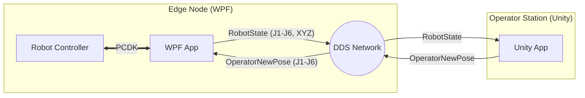

# Cognitive-Adaptive Telexistence (CAT) - Fanuc Node

**A high-performance Digital Twin interface for Fanuc industrial robots, bridging the physical world with Unity via RTI Connext DDS.**

---

## 📖 Overview

The **CAT Project** implements a real-time, bidirectional interface between a Fanuc Robot Controller (physical or simulated in RoboGuide) and a Unity-based virtual environment. It leverages the **Data Distribution Service (DDS)** standard to ensure low-latency, reliable communication suitable for teleoperation and remote monitoring.

### Key Features
*   **Real-time Monitoring**: Streams robot joint angles and Cartesian position to Unity at high frequency (>30Hz).
*   **Teleoperation**: Allows an operator in Unity (VR or Desktop) to control the physical robot.
*   **Safety First**: Implements reachability checks, limit verification, and "dead-man" switches to prevent unsafe movements.
*   **DDS Integration**: Uses RTI Connext DDS for robust, decoupled communication.

---

## 🏗 System Architecture

The system consists of two main applications:

### 1. WPF Application (`CAT_wpf_app`)
Acts as the **Edge Node** or "Driver". It runs on the Windows PC connected to the robot controller.
*   **Libraries**: Uses `FRRobot.dll` (Fanuc PCDK) for robot communication and `rcsd_net.dll` (RTI DDS) for network data.
*   **Role**:
    *   **Publisher**: Reads `CurPosition` (Joints/World) and publishes to `RobotState_Topic`.
    *   **Subscriber**: Listens to `OperatorNewPose_Topic` and writes to the robot's Position Registers.

### 2. Unity Application (`CAT_unity_project`)
Acts as the **Operator Station**.
*   **Role**:
    *   **Subscriber**: Visualizes the robot's live state.
    *   **Publisher**: Sends target joint configurations based on operator input.

### Data Flow Diagram


---

## 📂 Repository Structure

```text
IFAC_Project/
├── CAT_wpf_app/                 # C# WPF Application
│   ├── MainViewModel.cs         # Core Logic & UI Binding
│   ├── RobotStatePublisher.cs   # DDS Publisher (Robot -> DDS)
│   ├── TeleopSubscriber.cs      # DDS Subscriber (DDS -> Robot)
│   ├── MainWindow.xaml          # User Interface
│   └── ...
├── CAT_unity_project/           # Unity 3D Project
│   ├── Assets/
│   │   ├── DDS/                 # DDS Scripts
│   │   │   ├── DDSHandler.cs    # DDS Lifecycle Manager
│   │   │   ├── FanucDataSubscriber.cs
│   │   │   └── TeleopDataPublisher.cs
│   │   └── ...
├── QOS.xml                      # DDS Quality of Service Profile
├── rti_license.dat              # RTI Connext License File
└── README.md                    # This file
```

---

## ⚙️ Prerequisites

### Hardware
*   **Fanuc Robot** (e.g., CRX-10iA) or **Fanuc RoboGuide** simulation.
*   Windows PC (Windows 10/11).
*   Ethernet connection to the robot.

### Software
1.  **RTI Connext DDS** (Version 6.x or 7.x).
2.  **Fanuc PC Developer's Kit (PCDK)**: Required for `FRRobot.dll`.
3.  **Visual Studio 2022**: For building the WPF app.
4.  **Unity 2022.3 LTS** (or newer): For the visualization app.

---

## 🚀 Installation & Setup

### 1. DDS Configuration
*   Ensure `rti_license.dat` is placed in the root of both the WPF project and the Unity project (or set `RTI_LICENSE_FILE` environment variable).
*   The `QOS.xml` file defines the network behavior. Ensure it is present in the execution directory.

### 2. WPF Application
1.  Open `CAT_wpf_app.sln` in Visual Studio.
2.  **References**: Ensure `FRRobot.dll` is referenced. If missing, locate it in your Fanuc PCDK installation (usually `C:\Program Files (x86)\FANUC\Shared\Controls\FRRobot.dll`).
3.  **NuGet Packages**: Restore NuGet packages (RTI DDS libraries).
4.  **Build**: Build the solution (Debug or Release).

### 3. Unity Application
1.  Open the `CAT_unity_project` folder in Unity Hub.
2.  Ensure the RTI DDS C# libraries are present in `Assets/Plugins` (if not managed by a package).
3.  Open the main scene (e.g., `Assets/Scenes/MainScene.unity`).

---

## 🎮 Usage Guide

### Phase 1: Start the WPF Node
1.  Run `CAT_wpf_app.exe`.
2.  **Configuration**:
    *   **IP**: Enter the Robot's IP address (e.g., `127.0.0.1` for RoboGuide).
    *   **QOS/Lic**: Verify paths to XML and License files.
3.  **Connect**: Click the green **Connect** button.
    *   *Status should change to "Connected" (Green).*
    *   *Live Robot Data (J1-J6) should appear in the "Robot State" tab.*

### Phase 2: Start Unity Visualization
1.  Press **Play** in the Unity Editor.
2.  The virtual robot should immediately snap to the physical robot's pose.
3.  *Verify*: Move the physical robot (or jog in RoboGuide); the Unity robot should follow instantly.

### Phase 3: Teleoperation (Control Robot from Unity)
**⚠️ WARNING: Ensure the robot area is clear. Teleoperation moves the robot automatically.**

1.  **WPF App**: Go to the **Teleoperation** tab.
2.  **Unity**: Enable "Teleop Mode" (or move the Target Ghost object).
    *   *You should see "Target Joints" changing in the WPF App.*
    *   *Reachability should say "Reachable" (Green).*
3.  **WPF App**:
    *   Click **Reset** (Yellow) to clear any existing faults.
    *   Click **Start Teleoperation** (Green).
    *   *The robot will now follow the Unity target.*
4.  **Stop**: Click **Abort** (Red) or **Disconnect** to stop immediately.

---

## 📡 Technical Details: DDS Topics

### 1. `RobotState_Topic` (Robot $\to$ Unity)
*   **Type Name**: `RobotState`
*   **Structure**:
    *   `Clock` (String): Timestamp.
    *   `Sample` (Int): Sequence number.
    *   `J1`...`J6` (Double): Joint angles in **Degrees**.
    *   `X`, `Y`, `Z`, `W`, `P`, `R` (Double): Cartesian pose (mm, deg).

### 2. `OperatorNewPose_Topic` (Unity $\to$ Robot)
*   **Type Name**: `OperatorNewPose`
*   **Structure**:
    *   `J1`...`J6` (Double): Target Joint angles in **Degrees**.
    *   `Samples` (Int): Sequence number.

---

## 🔧 Troubleshooting

### Common Issues

**1. `SRVO-115 Limit Error` (Robot Fault)**
*   **Cause**: The robot received a target position of `0,0,0,0,0,0` (all zeros), which is often unreachable or out of bounds.
*   **Fix**:
    *   Ensure Unity is running **before** clicking "Start Teleoperation".
    *   Check the "Target Joints" in the WPF Teleop tab. Do **not** start if they are all zeros.
    *   Click **Reset** in the WPF app to clear the fault.

**2. "DDS Participant is not initialized"**
*   **Cause**: Missing license file or invalid `QOS.xml`.
*   **Fix**: Check the "System Logs" in the WPF app. Ensure `rti_license.dat` is valid and accessible.

**3. Robot Connection Failed**
*   **Cause**: Wrong IP, or RoboGuide is not running.
*   **Fix**: Ping the robot IP from command prompt. Ensure "PC Interface" option is enabled on the robot.

---

## 📝 Authors
*   **Damien Mazeas** - *IFAC Project*
