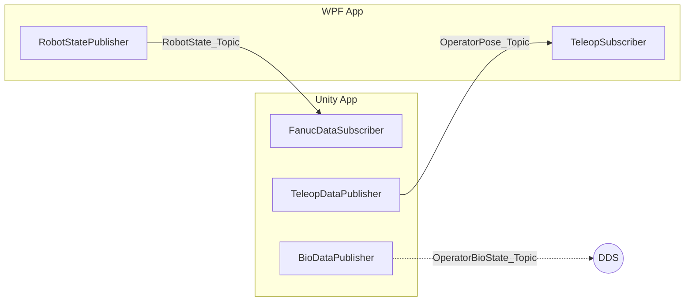

# CAT Project - Digital Twin Interface

This project implements a real-time Digital Twin interface for industrial robotic systems, specifically Fanuc robots. It bridges the physical world (or simulated Roboguide environment) with a digital visualization in Unity using the Data Distribution Service (DDS) for high-performance, real-time communication.

## 🏗 System Architecture

The system consists of two main applications communicating bidirectionally via RTI Connext DDS:

1.  **WPF Application (`CAT_wpf_app`)**: 
    *   **Publisher**: Connects to the Fanuc Robot Controller, reads the robot's state (Joints & Cartesian), and publishes it to DDS.
    *   **Subscriber**: Subscribes to teleoperation commands from Unity and updates the robot's registers.
2.  **Unity Application (`CAT_unity_project`)**: 
    *   **Subscriber**: Receives robot state updates and visualizes the robot's movement.
    *   **Publisher**: Publishes teleoperation commands (Target Pose & Speed) based on user interaction.

---

## 🖥️ WPF Application

Located in: `CAT_wpf_app/`

The WPF application is a standalone desktop tool for robot control and monitoring.

### Key Components
*   **`RobotStatePublisher.cs`**: 
    *   **Data Acquisition**: Polls the robot's `CurPosition` (Joints & World) via `FRRobot`.
    *   **Change Detection**: Publishes data only when changes exceed a threshold (`0.0001`).
    *   **Topic**: `RobotState_Topic`.
*   **`TeleopSubscriber.cs`**: 
    *   **Role**: Receives teleoperation commands from Unity.
    *   **Action**: Updates the robot's Position Register `PR[3]` with the received target pose.
    *   **Topic**: `OperatorPose_Topic`.
*   **`MainViewModel.cs`**: Orchestrates the application logic, handles UI binding, and manages DDS entities.

### User Interface
The UI has been enhanced with a **Live Robot Data** panel containing two tabs:
*   **Robot State**: Displays real-time Joint angles (J1-J6) and Cartesian coordinates (X, Y, Z, W, P, R).
*   **Teleoperation**: Visualizes the incoming target pose and speed from Unity, along with reception statistics (Samples Received, Rate).

---

## 🎮 Unity Application

Located in: `CAT_unity_project/`

The Unity project serves as the visualization and control interface.

### Key Scripts (Assets/DDS)

#### 1. `DDSHandler.cs`
**Role:** Central DDS Manager / Singleton
*   Initializes the DDS `DomainParticipant` using `QOS.xml`.
*   Manages the lifecycle of DDS entities.

#### 2. `FanucDataSubscriber.cs`
**Role:** Robot State Visualizer
*   Subscribes to `RobotState_Topic`.
*   Converts Fanuc coordinates (Right-Handed, mm) to Unity coordinates (Left-Handed, m).
*   Updates the 3D robot model's joint angles.

#### 3. `TeleopDataPublisher.cs`
**Role:** Teleoperation Source
*   Tracks a target GameObject in Unity.
*   Publishes its position, rotation, and speed to `OperatorPose_Topic`.
*   Handles coordinate conversion (Unity -> Fanuc).

#### 4. `BioDataPublisher.cs`
**Role:** Human Simulation
*   Simulates operator physiological state (Stress, Pupil Diameter) from CSV data.
*   Publishes to `OperatorBioState_Topic`.

### Mathematical Conversions

#### Coordinate System
*   **Fanuc**: Right-Handed, Millimeters.
*   **Unity**: Left-Handed, Meters.
*   **Scaling Factor**: 100 (Project specific).

$$
\begin{aligned}
X_{Unity} &= -\frac{X_{Fanuc}}{100} \\
Y_{Unity} &= \frac{Y_{Fanuc}}{100} \\
Z_{Unity} &= \frac{Z_{Fanuc}}{100}
\end{aligned}
$$

#### Orientation
Fanuc WPR (Euler) $\leftrightarrow$ Unity Quaternion conversions are handled automatically, including the necessary axis remapping.

---

## 📡 DDS Configuration

### Data Structures

#### 1. `RobotState` (Robot -> Unity)
| Field | Type | Description |
| :--- | :--- | :--- |
| `Clock` | String | Timestamp |
| `Sample` | Int | Sample ID |
| `J1` - `J6` | Double | Joint angles (Deg) |
| `X`, `Y`, `Z` | Double | Position (mm) |
| `W`, `P`, `R` | Double | Orientation (Deg) |

#### 2. `TeleopData` (Unity -> Robot)
| Field | Type | Description |
| :--- | :--- | :--- |
| `Id` | String | Sequence ID |
| `Timestamp` | Double | Time in seconds (Epoch) |
| `X`, `Y`, `Z` | Float | Target Position (mm) |
| `W`, `P`, `R` | Float | Target Orientation (Deg) |
| `Speed` | Float | Movement Speed |

### QoS Profile
Settings are loaded from `QOS.xml` (Default: `RigQoSLibrary::RigQoSProfile`).

---

## 🚀 Setup & Usage

1.  **Prerequisites**:
    *   RTI Connext DDS installed.
    *   `rti_license.dat` in project roots.
    *   Fanuc Roboguide or Real Robot.

2.  **WPF App**:
    *   Build & Run `CAT_wpf_app`.
    *   Enter Robot IP and Connect.
    *   Monitor "Robot State" tab for live data.
    *   Monitor "Teleoperation" tab for incoming commands.

3.  **Unity App**:
    *   Open `CAT_unity_project`.
    *   Play the scene.
    *   Move the Teleop Target object to send commands to the robot.
